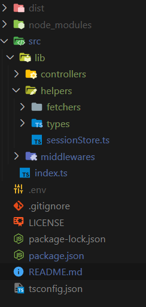

# GitWrapper

A wrapper over GitHub API to automate some specific set of tasks.

## Build Process

_NPM Required_

1. Clone the repository.
2. Run `npm install` to install all the dependencies.
3. Provision an in-memory database. (Redis)
4. Fill environment variables in `.env` file.(See `.env.example` for reference)
5. Run `npm run build` to build the project.
6. Run `npm run start` to start the project.
7. Optionally, run `npm run dev` to start the project in development mode. Nodemon is used to watch for changes in the source TS code and restart the server.

## Folder Structure

## API Documentation

### Authentication

#### Login

- `GET /user/login` redirects to GitHub OAuth login page.
- `GET /user/signin/callback` redirects back to the application after successful login with a `code` query parameter. This code is used to fetch the access token from GitHub asynchronously and the client is issued an auth cookie that references the access token from the in-memory store.
- `GET /user/logout` clears the auth cookie and clears the access token from the in-memory store. User data is not persisted in the database. This behaviour can be changed by adding a `User` model and persisting the user data in a long-term database like MongoDB.

#### Repos

- `GET /repos` takes `body.username` and returns all the accessible repositories of the specified user if they exist. If the user is not specified, it returns all the accessible repositories of the logged in user.
- `GET /repos/:username` is a URL param version of the above API.
- `PUT /repos/:repoName` takes `body.repoName` , and optionally `body.description` and `body.visibility`, and creates a new repository with the specified name, description and visibility. If the repository already exists, it returns an error.

#### Repo

- `GET /repo` takes `body.repoName` and returns the details of the specified repository if it exists. If the repository does not exist, it returns an error.
- `ALL /repo/topics` takes `body.repoName` and returns the topics of the specified repository if it exists. If the repository does not exist, it returns an error. Depending on the HTTP method, it can also be used to add or remove topics from the repository.

#### User

- `GET /user/secretFans` takes `body.username` and returns the list of users who have starred more than 2 of the specified user's repositories. If the user is not specified, it returns the list of users who have starred the logged in user's repositories.
- `GET /user/specificSecretFans` takes `body.username` and returns the list of users who have starred exactly 2 of the specified user's repositories. If the user is not specified, it returns the list of users who have starred exactly 2 of the logged in user's repositories. -`GET /user/popularRepos` takes `body.username` and returns the list of repositories of the specified user with >5stars and >5forks. If the user is not specified, it returns the list of repositories of the logged in user with >5stars and >5forks. -`GET /user/activeRepos` takes `body.username` and returns the list of repositories with > 5 commits by owner in last 10 days. If the user is not specified, it returns the list of repositories with > 5 commits by owner in last 10 days.

### ENV Variables

- `PORT` - Port on which the server will run.
- `SESSION_SECRET` - Cookie Session Secret.
- `CLIENT_ID` - Client ID of the GitHub OAuth App.
- `CLIENT_SECRET` - Client Secret of the GitHub OAuth App.
- `REDIS_URL` - URL of the Redis instance.

### GitHub API

- `https://api.github.com/users/:username` - Returns the user details.
- `https://api.github.com/users/:username/repos` - Returns the repositories of the specified user.
- `https://api.github.com/user/repos` - Returns the repositories of the logged in user.
- `https://api.github.com/repos/:username/:repoName` - Returns the details of the specified repository.
- `https://api.github.com/repos/:username/:repoName/topics` - Returns the topics of the specified repository.
- `https://api.github.com/repos/:username/:repoName/stargazers` - Returns the stargazers of the specified repository.
- `https://api.github.com/repos/:username/:repoName/commits` - Returns the commits of the specified repository.
- `https://api.github.com/repos/:username/:repoName` - Creates a new repository with the specified name, description and visibility.

### Testing

- No Automated Tests have been written.
- Manual testing has been done using Thunder Client/ Postman.
- **Testing files** are **included** in the static folder.

  

### Shortcomings

- No Automated Tests have been written.
- Error boundary could have been implemented on application space instead of router scope.
- Response intercepting middleware could have been perfected to recognize and drop any fields whose values contain `https://api.github.com`

### Future Scope

- Add a `User` model and persist the user data in a long-term database like MongoDB.
- Add automated tests.
- Cache the GitHub API responses in Redis to reduce the number of API calls.
- Rewrite code for a serverless architecture by shifting the in-memory database to a cloud-based database like Redis Labs or client side JWEs.
- Rewrite code with Octokit and GraphQL, but personally not a fan of batteries-included libraries.

### References

- [GitHub API](https://docs.github.com/en/rest)
- [Redis](https://redis.io/)
- [Express](https://expressjs.com/)
- [TypeScript](https://www.typescriptlang.org/)
- [Akoskm](https://akoskm.com/how-to-use-express-session-with-custom-sessiondata-typescript)
- [The Code Barbarian](http://thecodebarbarian.com/github-oauth-login-with-node-js.html)

### License

[MIT](https://choosealicense.com/licenses/mit/)
